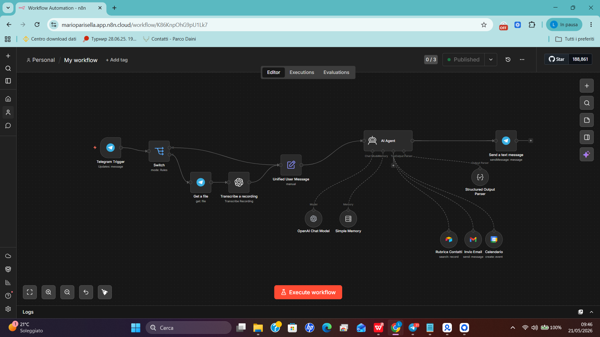

AI Agent Automation Workflow

AI Agent automation workflow built with n8n, OpenAI and Telegram.

The project supports both text and voice messages, automatically sends emails through Gmail, creates Google Calendar events and manages contacts using Airtable.

Features

- Text and voice message support
- Voice transcription using OpenAI
- Automated email sending with Gmail
- Google Calendar event creation
- Contact management with Airtable
- Unified input handling with "Unified User Message"

Technologies Used

- n8n
- OpenAI
- Telegram Bot API
- Airtable
- Gmail
- Google Calendar

Workflow Structure

The workflow includes:

- Telegram Trigger
- Text/Voice Switch
- Audio Transcription
- Unified User Message
- AI Agent
- Gmail Integration
- Google Calendar Integration

Demo Video

https://www.loom.com/share/f27217287113440faa7d72e50945c7b6

Screenshots

Project Goal

The goal of the project was to create an AI assistant capable of handling real-world tasks through Telegram using workflow automation and AI integrations.
